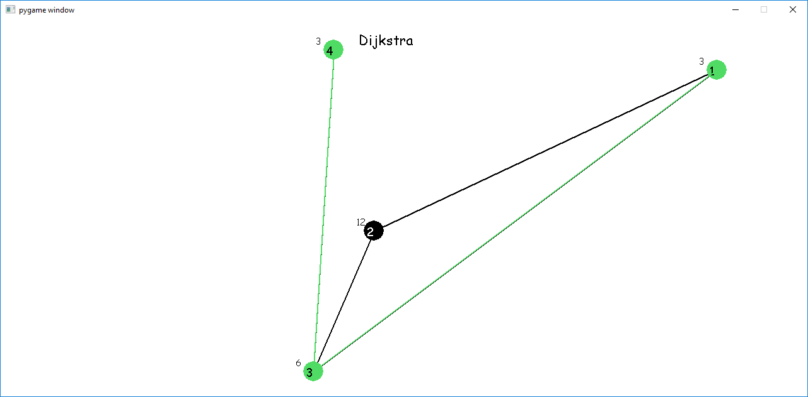
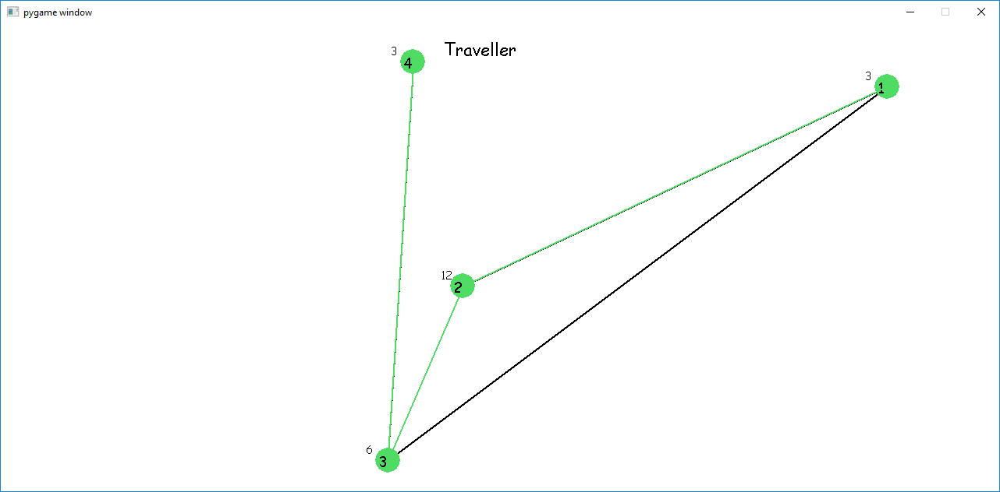
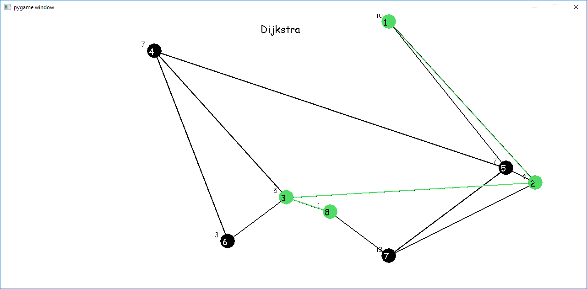
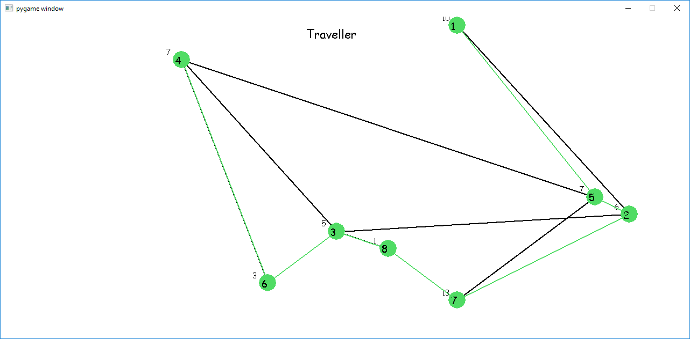
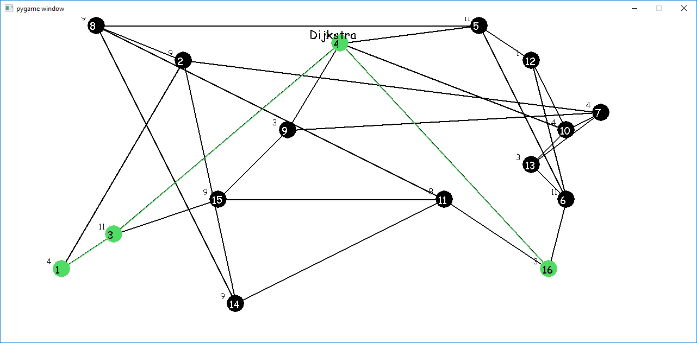
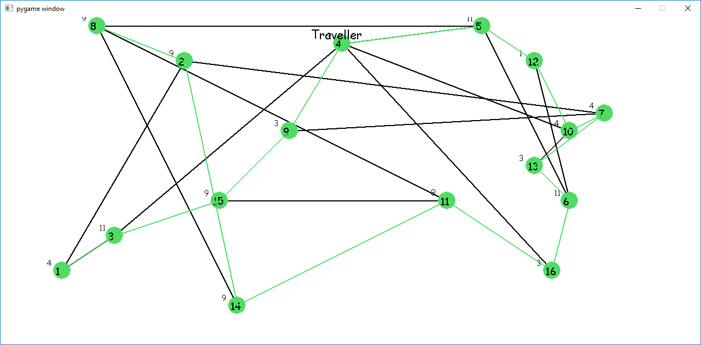
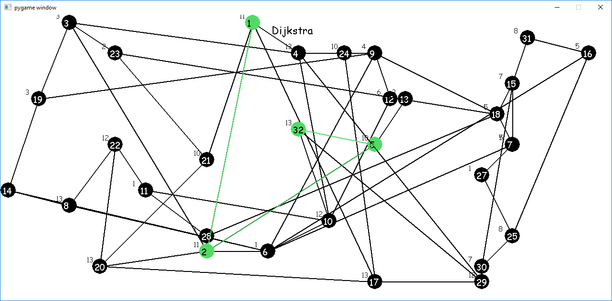
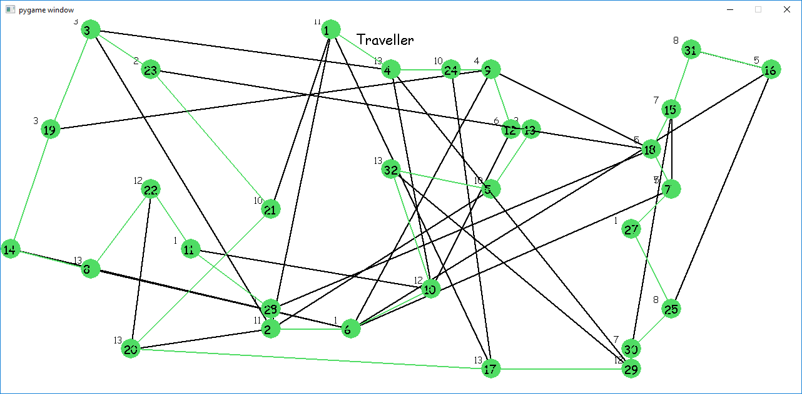

Random Graphs Generator\
 
Sistema interativo que gera grafos aleatórios, destacando o caminho mais curto e o caminho cíclico entre o primeiro e último vértice através dos algoritmos Dijkstra e Travelling Salesman.\
 
Interactive system that generates random graphs, highlighting the shortest path and the ciclic path between the first and the last node using Dijkstra's Algorithm and The Travelling Salesman Algorithm.\
 
Instructions:\
 
SPACEBAR    -> Generates a new Graph;\
UP KEY      -> Doubles the size of the Graph;\
DOWN KEY    -> Haves the size of the Grap;\
LEFT & RIGHT KEYS -> Switches between Dijkstra's and Travelling Salesman Algorithm.\
 
Images:\
  

  

  

  

  

  

  

  

